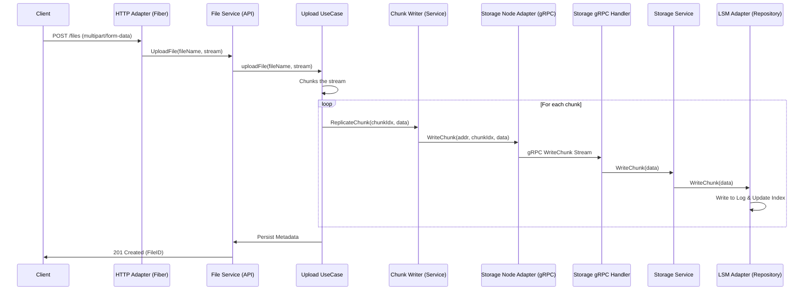

# Flow 01: Upload File (End-to-End Detail)

Tài liệu này mô tả chi tiết dòng chảy của yêu cầu Upload File, từ lúc Border Gateway nhận request HTTP cho đến khi dữ liệu được ghi xuống đĩa thông qua LSM Tree trên các Storage Node.

## 1. Bản đồ luồng dữ liệu (Request Tracing)



---

## 2. Chi tiết từng Layer & Minh họa Code

### Layer 1: Inbound HTTP Adapter
**File**: `internal/api/adapter/inbound/http/server.go`
Đóng vai trò là cổng vào (Border Gateway), xử lý giao thức HTTP và bóc tách stream dữ liệu.

```go
func (s *Server) handleUpload(c *fiber.Ctx) error {
    // 1. Phân tách multipart stream để lấy file source
    mr := multipart.NewReader(c.Context().RequestBodyStream(), boundary)
    part, _ := mr.NextPart()
    fileName := part.FileName()
    src := part // Duy trì stream, không load toàn bộ vào RAM

    // 2. Chuyển tiếp tới Service Layer (Domain logic)
    // Handoff: Chuyển từ HTTP context sang Business context
    finalFileID, err := s.service.UploadFile(c.Context(), fileName, src)
    
    return c.Status(201).JSON(fiber.Map{"id": finalFileID})
}
```

### Layer 2: API Service (Orchestrator)
**File**: `internal/api/service/upload_service.go`
Xử lý logic nghiệp vụ: Chia nhỏ file (chunking) và quản lý việc replication.

```go
func (s *uploadService) uploadFile(ctx context.Context, fileName string, reader io.Reader) (string, error) {
    // 1. Sinh ID duy nhất bằng Snowflake
    fileID, _ := s.nextFileID()

    // 2. Chunks & Replicate: Sử dụng Worker Pool để tối ưu parallelism
    // stats chứa thông tin tổng size và số chunk đã lưu thành công
    stats, err := s.streamAndReplicateChunks(ctx, fileID, reader)
    
    // 3. Metadata Persistence: Sau khi data an toàn, mới ghi metadata
    // Handoff: Gọi qua Metadata Service để lưu cấu trúc file
    return fileID, s.persistFileMetadata(ctx, fileID, fileName, stats)
}

func (s *uploadService) submitChunkReplication(...) {
    // Handoff: Gọi qua ChunkWriter (đối tượng chịu trách nhiệm replication)
    return workerPool.Submit(ctx, func() {
        // Gọi service chunker để đẩy data sang các node
        s.chunker.ReplicateChunk(ctx, fileID, chunkIndex, chunkData)
    })
}
```

### Layer 3: Outbound Storage Adapter (gRPC Client)
**File**: `internal/api/adapter/outbound/storage_node/grpc.go`
Xử lý giao tiếp mạng, retry, circuit breaker và streaming gRPC.

```go
func (a *GrpcAdapter) WriteChunk(ctx context.Context, addr string, ...) {
    // 1. Kiểm tra Circuit Breaker - Ngăn chặn gọi tới node đang quá tải
    breaker := a.getBreaker(addr)
    breaker.Execute(ctx, func(execCtx context.Context) error {
        // 2. Khởi tạo gRPC Stream tới Storage Node
        client, _ := a.getClient(addr)
        stream, _ := client.WriteChunk(execCtx)

        // 3. Đẩy từng mảnh nhỏ của chunk qua stream gRPC (64KB chunks)
        // Việc dùng stream giúp tối ưu memory và latency trên đường truyền
        for {
            n, _ := reader.Read(buf)
            stream.Send(&storagev1.WriteChunkRequest{Data: buf[:n], ...})
        }
        return stream.CloseAndRecv()
    })
}
```

### Layer 4: Storage Inbound Adapter (gRPC Server)
**File**: `internal/storage/adapter/inbound/grpc/server.go`
Nhận stream gRPC từ API và chuyển đổi ngược lại thành `io.Reader`.

```go
func (s *Server) WriteChunk(stream storagev1.StorageService_WriteChunkServer) error {
    // 1. Sử dụng io.Pipe để cầu nối (bridge) giữa gRPC Stream và io.Reader
    // Điều này giúp Storage Service xử lý dữ liệu như một luồng đọc bình thường.
    pr, pw := io.Pipe()
    go func() {
        for {
            req, _ := stream.Recv()
            pw.Write(req.Data)
        }
    }()

    // 2. Handoff: Chuyển dữ liệu đã chuẩn hóa tới Storage Service Layer
    return s.service.WriteChunk(stream.Context(), id, parentID, checksum, pr)
}
```

### Layer 5: Storage Repository (LSM Engine)
**File**: `internal/storage/adapter/outbound/lsm/lsm.go`
Tầng cuối cùng: Ghi dữ liệu xuống đĩa cứng.

```go
func (a *LSMAdapter) WriteChunk(ctx context.Context, id domain.ChunkID, ..., reader io.Reader) error {
    // 1. Append-only Write: Chỉ ghi nối tiếp vào cuối file segment
    // Ưu điểm: Tốc độ ghi cơ khí/SSD nhanh nhất vì không phải lookup vị trí
    offset, _ := a.activeFile.Seek(0, io.SeekEnd)
    written, _ := io.Copy(a.activeFile, reader)

    // 2. Index Update: Lưu vị trí vừa ghi vào In-memory map
    a.index[id] = IndexEntry{SegmentID: a.activeFileID, Offset: offset, Size: total}

    // 3. Merkle Tree Update: Cập nhật hash đại diện cho dữ liệu node
    // Phục vụ cho cơ chế Anti-entropy sau này
    a.updateMerkleTree(id)
    
    return nil
}
```

---

## 3. Tổng kết Công nghệ & Điểm mạnh

- **Fiber (Web Framework)**: Sử dụng `RequestBodyStream` để hiện thực hóa "True Streaming", dữ liệu không bao giờ bị nạp đầy vào RAM ở gateway.
- **Worker Pool & Resilience**: Quản lý concurrency ở API layer để cân bằng giữa tốc độ và độ ổn định hệ thống.
- **gRPC Bi-directional Streaming**: Giảm thiểu overhead của việc thiết lập kết nối cho từng chunk dữ liệu.
- **LSM Architecture**: Đảm bảo performance ghi luôn ổn định (O(1)) bất kể dữ liệu lớn đến đâu.
- **Merkle Tree Integration**: Mỗi lần ghi đều được "notified" vào cây Merkle, đảm bảo dữ liệu luôn sẵn sàng được kiểm tra tính nhất quán.
