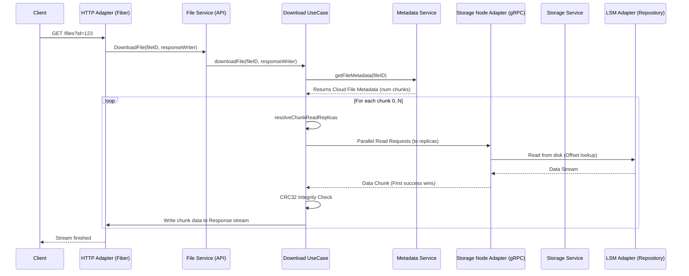

# Flow 02: Download File (End-to-End Detail)

Tài liệu này chi tiết quy trình truy xuất file, từ yêu cầu HTTP của Client cho đến khi các mảnh (chunk) được tập hợp từ nhiều Storage Node và trả về stream duy nhất.

## 1. Bản đồ luồng dữ liệu (Request Tracing)



---

## 2. Chi tiết từng Layer & Minh họa Code

### Layer 1: Inbound HTTP Adapter
**File**: `internal/api/adapter/inbound/http/server.go`

```go
func (s *Server) handleDownload(c *fiber.Ctx) error {
    fileID := c.Query("id")
    
    // 1. Thiết lập Header để trình duyệt hiểu đây là File Download
    c.Set("Content-Disposition", "attachment; filename=...")
    c.Set("Content-Type", "application/octet-stream")

    // 2. Stream Data: Sử dụng BodyWriter trực tiếp của Fiber
    // Handoff: Dữ liệu từ Storage sẽ được đẩy thẳng vào socket TCP của client
    return s.service.DownloadFile(c.Context(), fileID, c.Response().BodyWriter())
}
```

### Layer 2: API Service (Download Orchestrator)
**File**: `internal/api/service/download_service.go`

```go
func (s *downloadService) downloadFile(ctx context.Context, fileID string, writer io.Writer) error {
    // 1. Lấy "Bản đồ file" (Metadata)
    // Handoff: Gọi Metadata service để biết file có bao nhiêu chunk
    meta, _ := s.metadata.getFileMetadata(ctx, fileID)

    // 2. Duyệt qua từng Chunk tuần tự để đảm bảo thứ tự file
    for chunkIndex := 0; chunkIndex < meta.Chunks; chunkIndex++ {
        // Handoff: Đọc chunk với tính nhất quán (Consistency)
        chunkData, _ := s.readChunkWithConsistency(ctx, fileID, chunkIndex, readConsistency)
        
        // 3. Ghi dữ liệu vào stream response
        writer.Write(chunkData)
    }
    return nil
}

func (s *downloadService) readChunkWithConsistency(...) {
    // Fan-out Parallelism: 
    // Gửi yêu cầu tới tất cả replica cùng lúc. 
    // Node nào trả về nhanh nhất và đúng checksum sẽ được chọn ngay.
    for _, replica := range replicas {
        go func(node shard.Node) {
            data, _ := s.readChunkFromReplica(ctx, node, chunkID)
            resultChan <- data
        }(replica)
    }
    // Thu thập kết quả và áp dụng Quorum/One logic...
}
```

### Layer 3: Storage Repository (LSM Read)
**File**: `internal/storage/adapter/outbound/lsm/lsm.go`

```go
func (a *LSMAdapter) ReadChunk(ctx context.Context, id domain.ChunkID) (uint32, io.ReadCloser, error) {
    // 1. In-memory Lookup: Tìm vị trí file cực nhanh (O(1))
    a.indexMu.RLock()
    entry, exists := a.index[id]
    a.indexMu.RUnlock()

    // 2. Disk ReadAt: Mở file segment và nhảy (seek) tới đúng offset
    f, _ := os.Open(path)
    
    // 3. Header Parsing: Đọc metadata nội bộ của segment (size, checksum)
    binary.BigEndian.Uint32(header[0:4]) // idLen
    
    // 4. Return Stream: Sử dụng LimitedReader để đảm bảo không đọc quá phạm vi chunk
    return checksum, &limitedReadCloser{R: io.LimitReader(f, dataLen), C: f}, nil
}
```

---

## 3. Tổng kết Công nghệ & Điểm mạnh

- **Tail Latency Optimization**: Cơ chế đọc song song từ nhiều replica giúp triệt tiêu hiện tượng một node mạng chậm làm ảnh hưởng toàn bộ quá trình download.
- **Sequential Streaming**: Bằng cách kết hợp vòng lặp tuần tự (cho chunk) và xử lý song song nội bộ (cho replica), hệ thống đảm bảo sự cân bằng giữa tính đúng đắn và tốc độ.
- **Zero-Copy Intent**: Mặc dù vẫn qua bộ nhớ gateway, dữ liệu được truyền dưới dạng buffer fragments giúp giảm overhead.
- **LSM Efficiency**: Việc tìm kiếm dữ liệu trên đĩa chỉ mất 1 thao tác I/O tìm kiếm (Seek) nhờ index luôn nằm trong RAM.
