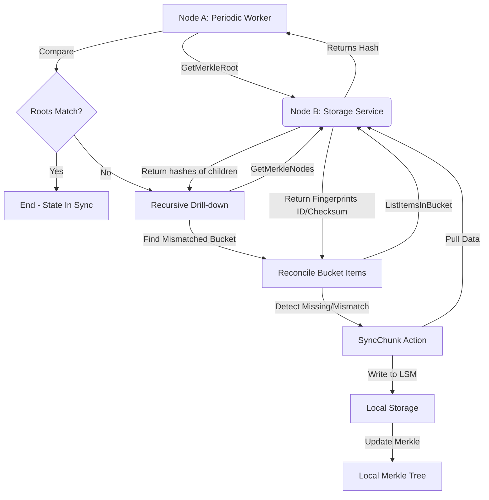

# Flow 04: Sync Data (Anti-Entropy) - End-to-End Detail

Tài liệu này mô tả chi tiết quy trình tự động đồng bộ và sửa chữa dữ liệu giữa các node bằng cây Merkle và LSM Tree.

## 1. Bản đồ luồng dữ liệu (Process Tracing)



---

## 2. Chi tiết từng Layer & Minh họa Code

### Layer 1: Anti-Entropy Service (The Auditor)
**File**: `internal/storage/service/anti_entropy.go`
Đóng vai trò là "Kiểm toán viên", đi so sánh dữ liệu với các node khác.

```go
func (s *antiEntropyService) runIntraShardReconciliation(ctx context.Context, peer shard.Node) {
    // 1. Hỏi node hàng xóm: "Root dữ liệu của bạn là gì?"
    // Handoff: Gọi qua gRPC client tới storage node khác
    peerRoot, _ := s.core.replication.GetMerkleRoot(ctx, peer.Addr)

    // 2. Lấy root dữ liệu của chính mình
    localRoot, _ := s.core.topology.getMerkleRoot(ctx)

    // 3. Nếu khác nhau, bắt đầu quy trình "khoan sâu" (Drill-down)
    if peerRoot != localRoot {
        // Bắt đầu từ node gốc (index 0)
        s.reconcileMismatchedNode(ctx, peer.Addr, 0)
    }
}

func (s *antiEntropyService) reconcileMismatchedNode(ctx context.Context, peerAddr string, idx int32) {
    // 1. Lấy dữ liệu nhánh con của cả 2 node để so sánh
    peerNodes, _ := s.core.replication.GetMerkleNodes(ctx, peerAddr, []int32{idx})
    localNodes, _ := s.core.topology.getMerkleNodes(ctx, []int32{idx})

    // 2. Logic so sánh nhị phân:
    // Nếu hash con trái khác nhau -> đệ quy xuống nhánh trái (2*idx + 1)
    if localNode.LeftHash != peerNode.LeftHash {
        s.reconcileMismatchedNode(ctx, peerAddr, 2*idx + 1)
    }
    // Tương tự cho nhánh phải (2*idx + 2)
}
```

### Layer 2: Sync Action (Data Puller)
**File**: `internal/storage/service/sync_chunk_service.go`
Khi phát hiện sai lệch, layer này chịu trách nhiệm kéo dữ liệu về.

```go
func (s *syncChunkService) syncChunk(ctx context.Context, chunkID string, sourceAddr string) error {
    // 1. Mở stream đọc từ node nguồn (Source)
    // Handoff: Gọi gRPC ReadChunk tới node bạn
    _, reader, _ := s.core.replication.ReadChunk(ctx, sourceAddr, chunkID)

    // 2. Ghi trực tiếp vào kho lưu trữ nội bộ
    // Handoff: Gọi LSM Adapter để lưu dữ liệu mới kéo về
    // Lưu ý: Ghi vào LSM sẽ tự động kích hoạt cập nhật lại Merkle Tree cục bộ
    return s.core.storage.WriteChunk(ctx, domain.ChunkID(chunkID), "sync", checksum, reader)
}
```

### Layer 3: Merkle Tree Engine (The Comparator)
**File**: `pkg/merkle/tree.go`
Cấu trúc dữ liệu lõi giúp so sánh nhanh.

```go
func (t *MerkleTree) UpdateBucket(bucketID int, leafHash string) error {
    t.mu.Lock()
    defer t.mu.Unlock()

    // 1. Cập nhật hash tại nút lá (Leaf)
    idx := t.leafOffset + bucketID
    t.nodes[idx] = leafHash

    // 2. Lan tỏa (Bubble up) sự thay đổi lên Root
    // Chỉ mất log2(1024) = 10 bước tính toán để cập nhật lại toàn bộ cây
    for idx > 0 {
        parentIdx := (idx - 1) / 2
        // Hash node hiện tại với node anh em để tạo hash cho node cha
        t.nodes[parentIdx] = t.hashPair(t.nodes[left], t.nodes[right])
        idx = parentIdx
    }
    return nil
}
```

---

## 3. Tổng kết Công nghệ & Điểm mạnh

- **Merkle Tree Reconciliation**: Giảm thiểu chi phí so sánh dữ liệu từ O(N) (liệt kê mọi file) xuống O(log N). Đặc biệt hữu ích trong hệ thống phân tán với hàng tỷ file.
- **Fixed-size Heap Tree**: Sử dụng mảng phẳng (flat array) để lưu cây Merkle giúp không làm phiền Garbage Collector và truy cập vùng nhớ nhanh.
- **Pull-based Sync**: Node bị thiếu chủ động kéo dữ liệu về (Anti-entropy) thay vì node thừa đẩy đi. Điều này giúp hệ thống tự ổn định (Self-healing).
- **LSM Idempotency**: Khi sync ghi đè một chunk đã có nhưng bị hỏng, LSM Tree đơn giản là append bản mới vào cuối log. Các bản cũ sẽ được dọn dẹp bởi Compaction process sau này.
- **Cross-Shard Detection**: Cơ chế này cũng phát hiện được khi nào dữ liệu nằm ở node sai (nhầm shard) và chuyển nó về đúng nhà của nó.
