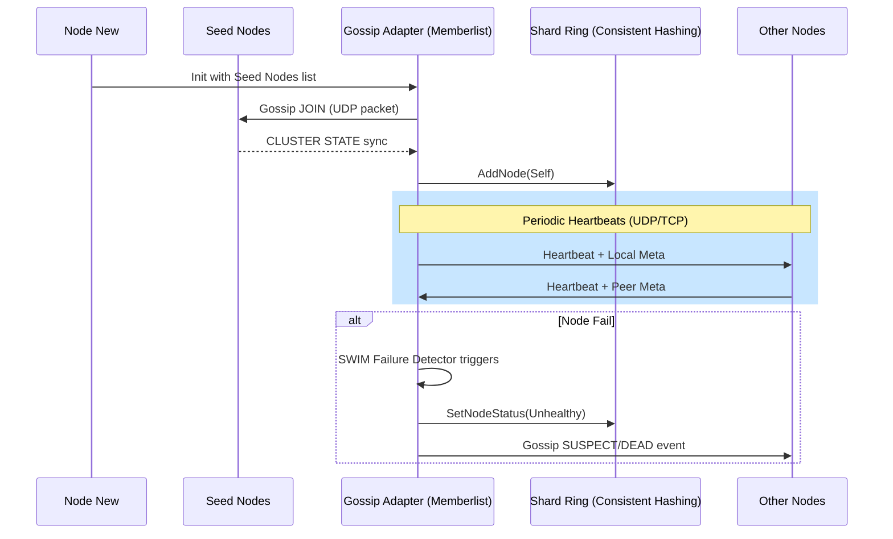

# Flow 05: Memberlist Management - End-to-End Detail

Tài liệu này chi tiết cách hệ thống quản lý danh sách các node và duy trì tính nhất quán của Cluster Topology mà không cần node điều phối trung tâm.

## 1. Bản đồ luồng dữ liệu (Discovery & Update)



---

## 2. Chi tiết từng Layer & Minh họa Code

### Layer 1: Memberlist Delegate (The Speaker)
**File**: `pkg/gossip/memberlist.go`
Đóng vai trò là đại diện phát tin và nhận tin từ mạng lưới Gossip.

```go
// NodeMeta: Đây là "Danh thiếp" của node. 
// Nó được gửi đi kèm theo mọi gói tin heartbeat để thông báo đặc tính của node cho cluster.
func (g *GossipAdapter) NodeMeta(limit int) []byte {
    // Gói tin cực nhỏ (JSON size) để tiết kiệm băng thông mạng UDP
    data, _ := json.Marshal(map[string]interface{}{
        "shard_id":    g.shardID,    // Node này thuộc Shard nào
        "replica_id":  g.replicaID,  // Thứ tự replica trong shard
        "server_port": g.serverPort, // Cổng API để Gateway có thể kết nối tới
    })
    return data
}

// NotifyJoin: Được gọi khi phát hiện có "ông hàng xóm mới" xuất hiện.
func (g *GossipAdapter) NotifyJoin(node *memberlist.Node) {
    // 1. Giải mã danh thiếp của node mới
    shardID, replicaID, serverPort := decodeMeta(node.Meta)
    
    // 2. Chuẩn hóa địa chỉ service của node
    fullAddr := net.JoinHostPort(node.Addr.String(), strconv.Itoa(serverPort))

    // 3. Đăng ký node mới vào Ring. 
    // Từ đây, thuật toán Consistent Hashing sẽ tính toán lại vùng dữ liệu cho node này.
    g.ring.AddNode(shard.Node{
        ID: node.Name,
        Addr: fullAddr,
        ShardID: shardID,
        ReplicaID: replicaID,
    })
}
```

### Layer 2: Shard Ring (The Map)
**File**: `pkg/shard/ring.go` (Implicitly managed)
Nơi quản lý bản đồ phân bổ dữ liệu dựa trên kết quả của Gossip.

```go
func (r *Ring) AddNode(node Node) {
    r.mu.Lock()
    defer r.mu.Unlock()

    // 1. Gán node vào danh sách quản lý
    r.nodes[node.ID] = node

    // 2. Virtual Nodes (VNodes) - Điểm mấu chốt của Consistent Hashing
    // Hệ thống tạo hàng trăm "bản sao ảo" cho mỗi node trên vòng tròn băm.
    // Giúp phân bổ dữ liệu cực kỳ đồng đều, tránh "node béo - node gầy".
    for i := 0; i < r.vnodesPerNode; i++ {
        token := r.hash(fmt.Sprintf("%s-%d", node.ID, i))
        r.tokens = append(r.tokens, token)
        r.tokenToNode[token] = node.ID
    }
    
    // 3. Sắp xếp lại token để tìm kiếm theo Binary Search (O(log N))
    sort.Sort(r.tokens)
}
```

---

## 3. Tổng kết Công nghệ & Điểm mạnh

- **SWIM Protocol**: Cơ chế phát hiện lỗi thông minh, không phụ thuộc vào một node quan sát duy nhất, giúp loại bỏ dương tính giả (False Positive) khi mạng bị chập chờn cục bộ.
- **Consistent Hashing with VNodes**: Đảm bảo khi một node Join/Leave, chỉ có một phần nhỏ dữ liệu (1/N) cần phải di động, thay vì phải xáo trộn toàn bộ cluster.
- **UDP Heartbeats**: Sử dụng giao thức UDP cho heartbeat giúp giảm cực lớn chi phí overhead so với TCP.
- **Zero Configuration**: Chỉ cần biết địa chỉ một vài node hạt giống (Seed Nodes), cả cluster sẽ tự động tìm thấy nhau.
- **Eventual Consistency Topology**: Mặc dù topology ở các node có thể khác nhau trong vài mili-giây, cơ chế Anti-entropy (Flow 04) sẽ sửa chữa bất kỳ sai sót nào phát sinh do sự sai lệch topology này.
